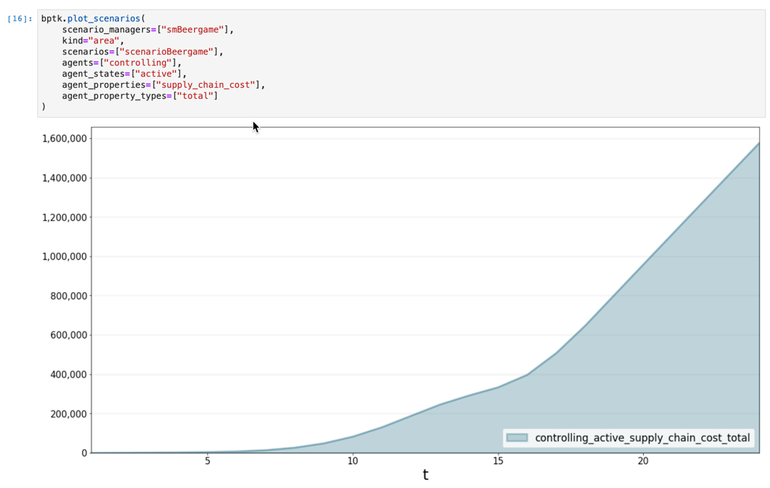

# Having Fun With the Beer Distribution Game
## Computational notebooks, agent-based simulations and AI training algorithms

The Beer Game was developed in the 1960s at MIT to illustrate how difficult it is to manage dynamic systems – in this case a supply chain that delivers beer from a brewery to the end consumer.

This repository contains computational notebooks,  simulation models and AI training algorithms that explore the game  in depth.

Please read the companion blog posts on our [website](https://www.transentis.com/understanding-the-beer-game/). You can also find a companion slidedeck on [slides.com](https://transentis.slides.com/ograsl/beer_game)

Have a go at playing the Beer Game (on your own or – much more fun – in a group) before you read the notebooks:

* A single player version of the Beer Game can be found on our [website](https://www.transentis.com/current-topics/business-games/beer-game/). 
* We also have a multiplayer version of the Beer Game set up as a [docker container](https://hub.docker.com/r/transentis/beergame).

The notebooks use the [BPTK-Py package](https://bptk.transentis-labs.com/en/latest/index.html), which provides System Dynamics and Agent-based modeling in Python.

## Repository Contents

### Notebooks

* __Understanding the Beergame.__ This is the best place to get started - play the Beer Game in single player mode and learn about the dynamics governing the game. This version uses a System Dynamics implementation of the Beer Game.
* __An Agent-based Approach To Modeling the Beer Game.__ An agent-based simulation of the beergame that can be used to test policies. It is also used as the basis for the reinforcement learning apporach described in the following notebook.
* __Training AI to play the Beer Game – A Reinforcement Learning Approach.__ This notebook introduces the concept of reinforcement learning and then applies it to training intelligent agents to play the Beer Game.

### Models

This repository contains two simulation models of the Beer Game - one build using System Dynamics and one built using Agent-based modeling. Both models produce identical results.

The SD version was built with Stella Architect, it can be found in the _simulation_models_ directory. This version of the simulation is used in the [Understanding the Beergame](understanding_the_beergame.ipynb) notebook.

The ABM version can be found in the  _src_ directory.  This version is is used in the [An Agent-based Approach To Modling the Beergame](beergame_abm.ipynb) and [Training AI to Play The Beer Game](training_ai_beergame.ipynb) notebooks.

## Installation And Testing Instructions

### Installing using Docker

If you have Docker installed (e.g. Docker Desktop on MacOS or on Windows), follow these steps:

* On the command line, move into a directory where you would like to store the Beergame repository.
* Clone the BPTK-Py tutorial repository using git clone: `git clone https://github.com/transentis/beergame.git
* Run `docker-compose up`
* Point your browser at [http://localhost:8888](http://localhost:8888) – this will open JupyterLab showing the contents of your directory.

### Installing using a Python virtual environment

Alternatively you can install using a Python virtual environment:

1. Clone this repo in a directory of your choice: `git clone`
2. Make sure you have python3 installed
2. Change into the repo and setup a python venv: `python3 -m venv venv`
3. Activate the venv: `source venv/bin/activate`
4. Install the required modules: `pip install -r requirements.txt`
5. Install the jupyter lab widgets: `jupyter labextension install @jupyter-widgets/jupyterlab-manager`
5. Start jupyter lab: `jupyter lab`

### Testing Your Installation

Once you have installed, to make sure everything is working open the notebook [beergame_abm.ipynb](beergame_abm.ipynb) and run all the cells - there should be no error messages and the last graph should look like the one below.

If you have any questions, let us know via email to [support@transentis.com](mailto://support@transentis.com).
